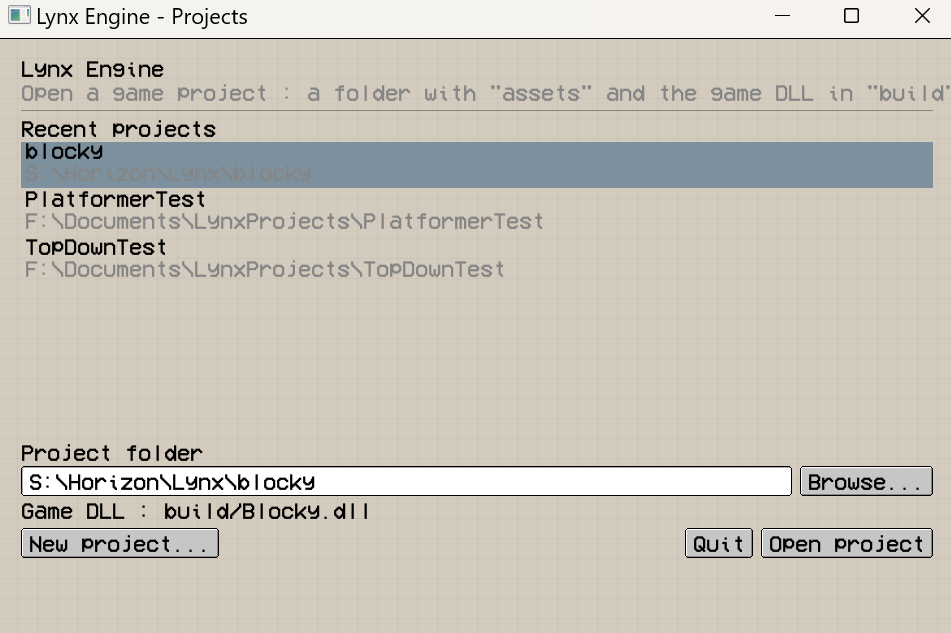
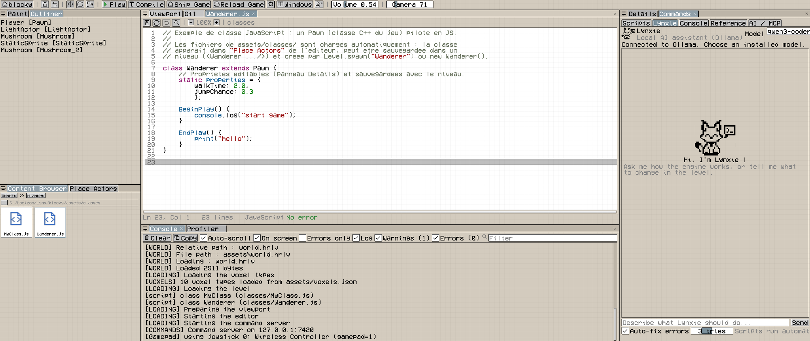
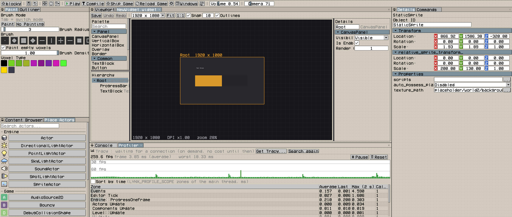

# This repo is a modified version of ImGui, ImNode and ImTextEdit, see original repos :

- [ImGui](https://github.com/ocornut/imgui)
- [ImNodes](https://github.com/Nelarius/imnodes)
- [ImTextEdit](https://github.com/ChemistAion/ImTextEdit)

## ImPixel does NOT modify the ImGui API.

## You can use this project in an existing ImGui project, as ImPixel doenst modify the ImGui API.

## Screenshots

